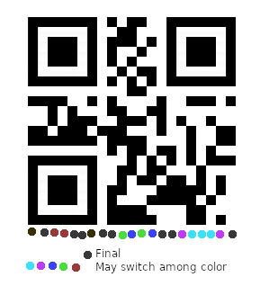
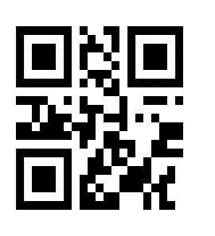

# Shredded
We get 27 images with black and white stripes that look like they may be part of a QR code. The six white images can be ignored, so the total number of permutations becomes `21! ~= 10^19`. Well, brute force is out. Lets try to reduce that by taking a look at the QR code specification.

1. The size is 21x21, so this is [version 1](http://www.qrcode.com/en/about/version.html), meaning there should a 7x7 black square containing a 5x5 white and a 3x3 black square in the top left, top right and bottom left corner. There has to be a white "quiet zone" around the squares.
2. There are [timing patterns](http://www.esponce.com/resources/about-qr-codes) (alternating black and white) at two places.
3. There is a black ["Dark module"](https://www.thonky.com/qr-code-tutorial/format-version-information#dark-module) at (8, 13).
4. There is a 15 bit [format string](https://www.thonky.com/qr-code-tutorial/format-version-information#format-string) encoding the error correction level and the mask pattern used. There are [32 alternatives](https://www.thonky.com/qr-code-tutorial/format-version-tables).


This means we need to fit this image:


(Source: https://www.thonky.com/qr-code-tutorial/format-version-information)


We use (1) to match up the squares and the surrounding quiet zone, (2) to select the right slice for column 6 and (2) and (3) to reduce the number of potential permutations for the center columns. 

Now there is a limited number of slices that match the two required black pixels in column 8 (the one with the full format string) and aren't already used for the squares. Let's see if any of them match with the wanted format strings using a litle Python script.

```python
# 1=black, 0=white

# wanted from https://www.thonky.com/qr-code-tutorial/format-version-tables
wanted = ["111011111000100", "111001011110011", "111110110101010", "111100010011101", "110011000101111", "110001100011000", "110110001000001", "110100101110110",      "101010000010010", "101000100100101" , "101111001111100", "101101101001011", "100010111111001", "100000011001110", "100111110010111", "100101010100000",    "011010101011111", "011000001101000", "011111100110001", "011101000000110", "010010010110100", "010000110000011", "010111011011010", "010101111101101", "001011010001001",      "001001110111110", "001110011100111", "001100111010000", "000011101100010", "000001001010101", "000110100001100", "000100000111011"]

# Based on possible pixels 0-6 (lower part of slice) in column 8
possible = ["1111000", "1010111", "1100011", "0010001", "1101110", "1111001"]

for f in wanted:
    # Check if the first part matches up
    if f[:7] not in possible:
        continue
    
    # There are two black and one white pixels in row 8, column 2-4
    sum = 0
    for i in range(2,5):
        if f[i] == "1":
            sum+=1
    if sum == 2:
        # We found something that matches all requirements
        print (f)
```

Luckily there is only one match, `111100010011101`. Combining all that we have the following situation



where slices marked black are final, a green column may still switch with another green column, a red with another red and so on. This means we have `2*2*2*2*3=48` permutations. Not to bad, time for some brute force:

```python
import itertools
from PIL import Image
from pyzbar.pyzbar import decode

# Read all images
images = map(Image.open, [str(i)+".png" for i in range(27)])
images = list(images)

widths, heights = zip(*(i.size for i in images))
total_width = sum(widths)
max_height = max(heights)

# Our best guess for now, based on image names
positions = [5, 6,25,16, 2, 15, 26, 3, 23, 19, 20, 10, 21, 7, 8, 1, 4, 22, 24, 18, 14]

# Encoding the requirements in the image above into code, first slice has to be image 5, second is image 6, third may be image 16 or 25 and so on.
for i in filter(lambda x: x[0] == 5 and x[1] == 6 and x[4] == 2 and x[5] == 15 and x[6] ==26 and x[7] == 3 and x[8] == 23 and x[13] == 7 and x[14] == 8 and x[20]==14 and x[2] in [16,25] and x[3] in [16,25] and x[9] in [19,10] and x[11] in [19,10] and x[10] in [20,21] and x[12] in [20,21] and x[15] in [1,18] and x[19] in [1,18] and x[16] in [4,22,24] and x[17] in [4,22,24] and x[18] in [4,22,24],itertools.permutations(positions)):
    # Combine slices into one image
    new_im = Image.new('RGB', (total_width, max_height),color=(255,255,255,0))
    x_offset = 20 # Leave some whitespace at the beginning

    for image_index in i:
        im = images[image_index]
        new_im.paste(im, (x_offset,0))
        x_offset += im.size[0]

    # Check if the generated QR code is valid
    if (decode(new_im) != []):
        print(decode(new_im))
        new_im.save("final.png")
```

After a few seconds we get the message `GOOD JOB. FLAG-80AD8BCF79` and the QR code

